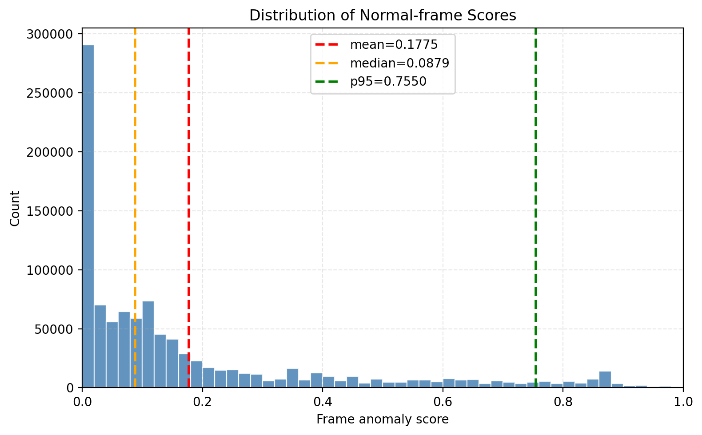
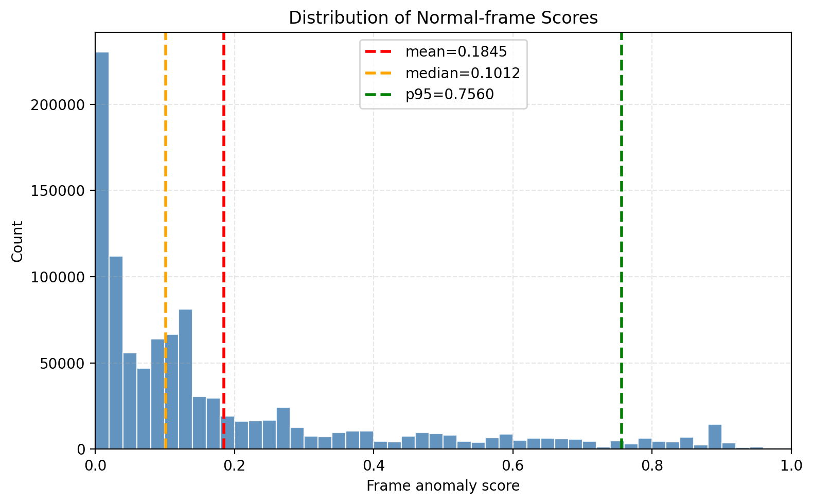

## **Table S1. Training-free methods surpass supervised baselines on challenging low-data1 dataset (MSAD, UBnormal).**
|   Methods	| Supervision          | MSAD $AUC$ 	|MSAD $AUC_a$  |MSAD $AP$|MSAD  $AP_a$ | UBnormal $AUC$ |
|------|----------------------|-------|-------|-------|-------|----------------|
|RTFM     | Weakly Supervised    |  86.65           |     -		| 66.30	|         -    | 60.94          |
|OVVAD| Weakly Supervised    |  -           |     -		|  -	|         -                    | 62.94          |
|MGFN | Weakly Supervised    |   84.96		 |    -         	|   -	| -	 | -              |   
|TEVAD | Weakly Supervised    |  86.82		 |    -           	|     -	| -      | -              |
|UR-DMU  | Weakly Supervised    |   85.78	|    67.95          |    67.35	| 75.30  | 59.9           |
|$\pi$ VAD | Weakly Supervised    |   88.68	|    71.25    |     71.26	| 77.86   | -              |
|Holmes-VAU | Instru-Tuned         |    -	|     -    |      -	|  -   | 56.77          |
|LAVAD | **Training-Free**		  |  -           |     -		|  -	|         -    | 64.23          |
|VADTree | **Training-Free**		  |89.32|67.85|71.41|75.49 | -              |
|Unified | **Training-Free**			 |85.9|-|76.4|-| 68.98          |
|PANDA | **Training-Free**			 |-|-|-|- | **75.78**      |
|**OneVAD(ours)** | **Training-Free**    |**92.36**|**76.47**|**78.19**|**81.45** | 74.30          |

1 The MSAD dataset has fewer training samples for each type of anomaly, while UBnormal is an open-set dataset.

## **Table S2 Component-level inference time consumption analysis of different methods on UCF-Crime dataset.**
|   Methods	| Video segmentation			|Video/Text Encoding  | VLM Caption			        | LLM Summary                    | LLM Scoring		         | Total(GPU hours)| AUC(%)|
|------|-------|-------|-----------------------|--------------------------------|-----------------------|  -------|  -------| 
|LAVAD(CVPR2024)    |   -                                     			|     5.1h           		| 20h  				             | 7.7h $\times$ 2 	              | 7.7h $\times$ 2 		    |	55.9			| 80.28	| 
|VADTree(NeurIPS2025)    |   0.3h			                                |    0.6h              		| 20.0h $\times$ 2	     | -			   	                       | 	10.7h $\times$ 2	    |	62.3			| 84.71 	|  
|			   |  							|					| **VLM Holistic pass** | **Collaborative Localization** | **VLM Zoom-in pass**	 |			 |
|**OneVAD(Ours)** |  0.3h 			                        |    -               		    	| 17.2h $\times$ 2	     | 	0.6h $\times$ 2		             | 2.8h $\times$ 2		     |	41.5	| **86.48**	|  

## **Table S3. Comparison of Decision Period, Processing Time, and Decision Delay.**
|   Methods| Decision Period(s)   |  Processing Time(s)   | Delay(s) | 
|------|-------|-------|-------|    
REWARD| 6.4| 0.5| 6.9|
Montior|0.6 |5.9 |6.5|
OneVAD-online(ours)| 5 |1.3 |6.3|

## ****Table S4. Distribution statistics of anomaly scores on normal frames and corresponding detection performance on the UCF-Crime dataset.** `mean`, `median`, `p95`, and `max` denote the average, median, 95th-percentile, and maximum anomaly scores over all normal frames, respectively. Lower values indicate better suppression of false positives, particularly for `p95` and `max`, which characterize the high-score tail of normal frames.**
| Methods                       | mean↓     | median↓   | p95↓      | max↓    | ALL frame AUC(%)↑ | 
|-------------------------------|-----------|-----------|-----------|--------|-------------------|
| OneVAD-Qwen2.5-VL-7B-Instruct | **0.1775** | **0.0879** | **0.7550** | 0.9968 | **86.48**         |
| -  sound symbolism            | 0.1845    | 0.1012    | 0.7560    | 0.9968 | 86.11             |

<table>
  <tr>
    <td align="center">
       
      (a) OneVAD-Qwen2.5-VL-7B-Instruct
    </td>
    <td align="center">
       
      (b) Without sound symbolism
    </td>
  </tr>
</table>

**Figure S4.** Distribution of anomaly scores on normal frames. The full model produces slightly lower `mean`, `median`, and `p95`, indicating a lighter high-score tail on normal frames and better suppression of false positives.

## **Table S5. Effect of intermediate-layer range selection on attention aggregation stability and anomaly detection performance on UCF-Crime.**

|Attention Aggregation Range	|Step Set	|Localization Stability (Range Consensus sIoU)↑	|AUC (%)↑
|-------------------------------|--------------|-------------------------------------------| 
0-20	|All decode steps	|0.3898	|85.64|
10-28	|All decode steps	|0.4480	|85.87|
10-20	|All decode steps	|**0.4905**	|**86.48**|
10-20	|First generated-token step	|0.4493	|84.52|

Note. Range Consensus sIoU is defined as the mean soft IoU between each selected layer and the prototype attention map obtained by averaging the selected layers within a given range, and is further averaged over segments and videos. For efficiency, attention maps are sampled with a layer interval of 2 and a decode-step interval of 5. For the last row, the score is computed only on the first generated-token step.

## **Table S6. Comparison of performance of OneVAD under different VLM on UCF-Crime dataset.**
| Methods                       | Release Date | AUC(%)                                    | 
|-------------------------------|--------------|-------------------------------------------| 
| OneVAD-LLaVA-NeXT-Video       | 2024.12      | Instruction following failed 3 |
| OneVAD-VideoLLaMA3-8B         | 2025.01      | Instruction following failed 3 |
| OneVAD-Qwen2.5-VL-7B-Instruct | 2025.03      | 86.48                                     |
| OneVAD-InternVL3-8B           | 2025.05      | 86.21                                     |
| OneVAD-InternVL3_5-8B         | 2025.08      | 86.43                                     |

3 While early VLMs possess relatively strong visual captioning capabilities, they remain insufficient in instruction following tasks that require complex reasoning and strict output formatting constraints, rendering them inapplicable to the OneVAD framework.

## **Table S7. Effect of different intermediate-layer ranges on attention aggregation stability and anomaly detection performance (AUC) on UCF-Crime dataset.**
| Cropping Strategy | | AUC(%) | 
|--------------------------------------|-----------------------------------------------------------|
| Per‑frame cropping (baseline)        | 84.31                                                  |
| Clip‑wise stable cropping (Ours)     | 86.48                                                   |

